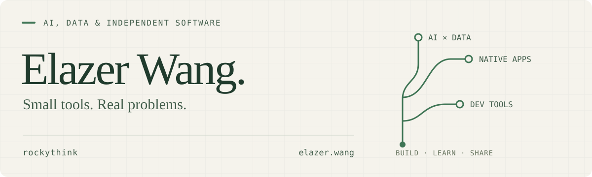

<picture>
  <source media="(prefers-color-scheme: dark)" srcset="./assets/header-dark.svg">
  <source media="(prefers-color-scheme: light)" srcset="./assets/header-light.svg">
  
</picture>

[个人站 / Website](https://elazer.wang) · [拾穗数据 / Writing](https://ss-data.cc) · [产品 / Products](https://elazer.wang/products) · [联系 / Email](mailto:hi@elazer.wang)

## Hi, I'm Elazer / 石头

**AI 和数据领域的研究者，也是一名独立开发者。**

我维护「拾穗数据」，写数据工程、架构和 AI 实践，也把自己日常遇到的问题做成工具：可信的数据查询、更少打扰的英文阅读、顺手的 Mac 工作流。

I work at the intersection of AI, data, and independent software. I build tools for real workflows and write about what I learn along the way.

## Selected open source / 开源项目

### AI × Data

- **[Forge](https://github.com/shisuidata/Forge)** — 面向 Data Agent 的可信数据查询基础设施：语义约束、确定性 SQL 编译、可审查的执行与审计。早期项目，适合受控评估。
- **[ss-data-skills](https://github.com/shisuidata/ss-data-skills)** — 面向数据开发工作流的 AI Agent Skills，把方法写成可复用的技能。

### Tools for everyday work

- **[RelyLess](https://github.com/rockythink/relyless)** — 保留英文原文，按需提供少量阅读提示。Chrome / Edge 扩展，通过 GitHub Releases 分发。
- **[limitdeck](https://github.com/rockythink/limitdeck)** — 注重隐私的 AI 订阅额度终端看板。
- **[拾穗弹幕台](https://github.com/rockythink/shisui-danmu)** — 面向知识型主播的弹幕与提问 TUI 工作台。
- **[omp-settings-zh](https://github.com/rockythink/omp-settings-zh)** — 官方 Oh My Pi 的简体中文设置本地化；不维护分叉，也不修改二进制。

## Made for Mac / 独立产品

**[Copyla](https://copyla.elazer.wang)** · 本地剪贴板工作台，检索历史、顺序粘贴与本机 OCR。  
**[Clacklet](https://clacklet.elazer.wang)** · 键盘与鼠标的声音、节奏和桌面反馈。  
**[Mac 净化器伴侣](https://github.com/rockythink/mac-purifier-companion)** · 免费开源的 Mac 状态监测与小米净化器联动工具。

[更多产品与开发记录 →](https://elazer.wang/indie-building)

## Notes & principles / 写作与取舍

先看问题，再选工具。能在本地完成的，就不绕远路；需要 AI 的地方，也把边界讲清楚。

我在 **[拾穗数据](https://ss-data.cc)** 记录数据工程、架构、AI 与职业成长，也维护 **[数据从业者的全栈知识库](https://pro.ss-data.cc)**（付费知识产品）。

---

欢迎聊数据与 AI 实践，也欢迎交流小工具：**[hi@elazer.wang](mailto:hi@elazer.wang)**
